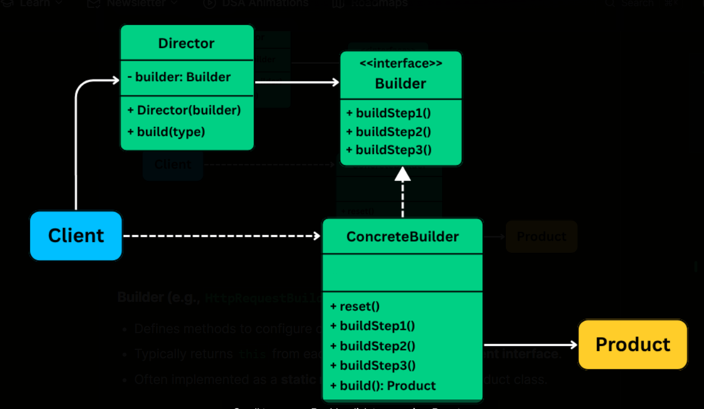

# Builder Pattern

The Builder Design Pattern is a creational pattern that lets you construct complex objects step-by-step, separating the construction logic from the final representation.

It’s particularly useful in situations where:

- An object requires many optional fields, and not all of them are needed every time.
- You want to avoid telescoping constructors or large constructors with multiple parameters.
- The object construction process involves multiple steps that need to happen in a particular order.

## Diagram

[]

## References

- [Algomaster.io](https://algomaster.io/learn/lld/builder)
