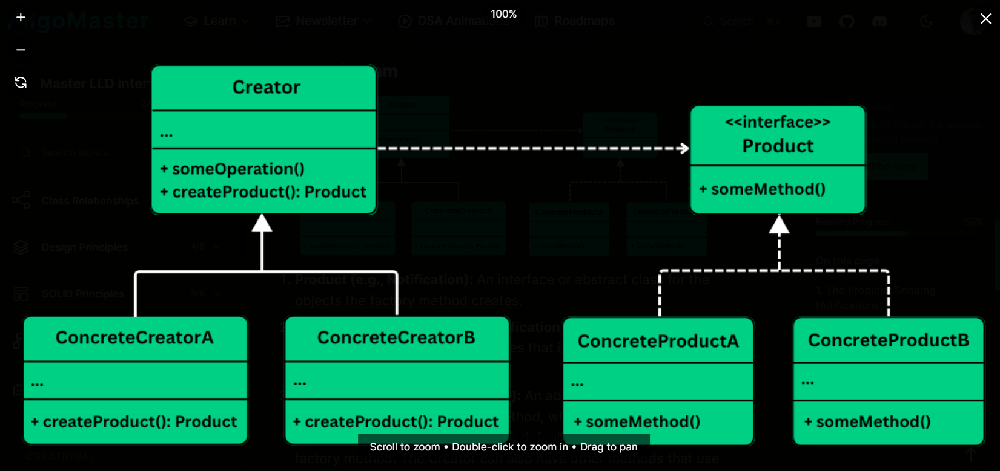

# Factory Method — Class Diagram

The diagram shows how the Factory Method pattern separates _what_ is created from _how_ it is used. [web:0] At the top there is a **Product** abstraction (for example, `Notification`), and below it several concrete products like `EmailNotification`, `SMSNotification`, and `PushNotification` that implement this interface. [web:0]

On the creator side, there is an abstract **Creator** (for example, `NotificationCreator`) that declares a factory method such as `createNotification(): Notification`. [web:0] This creator may also define high-level operations like `send()` that use the product returned by the factory method without knowing the concrete type. [web:0]

Each **ConcreteCreator** subclass (for example, `EmailNotificationCreator`, `SMSNotificationCreator`, `PushNotificationCreator`) overrides `createNotification()` to instantiate the appropriate concrete product. [web:0] Client code works with the `Creator` and `Product` abstractions, so new notification types can be added by introducing new `ConcreteProduct` and `ConcreteCreator` classes without changing existing logic. [web:0]

